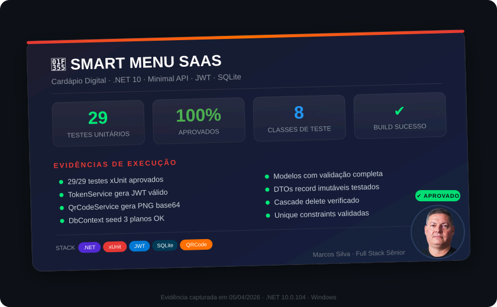

# 🍕 SmartMenu SaaS — Cardápio Digital Multi-Tenant

> Plataforma SaaS de cardápio digital para restaurantes, com arquitetura multi-tenant, autenticação JWT e QR Code para acesso público.


---

## 📋 Sobre o Projeto

O **SmartMenu** é uma solução SaaS completa que permite a restaurantes criarem e gerenciarem cardápios digitais acessíveis via QR Code. O sistema demonstra conceitos fundamentais de arquitetura SaaS:

- **Multi-tenancy**: cada restaurante é um tenant isolado com seus próprios dados
- **Autenticação JWT**: controle de acesso seguro por token
- **Planos de assinatura**: Free (1 restaurante, 15 itens) e Pro (ilimitado)
- **API pública**: cardápio acessível sem autenticação via slug único
- **QR Code**: geração automática para acesso ao cardápio

---

## 🏗️ Arquitetura

```
┌─────────────────┐     ┌──────────────────┐     ┌────────────────┐
│  Blazor WASM    │────▶│  .NET 10 API     │────▶│   SQLite       │
│  (Frontend)     │     │  (Minimal APIs)  │     │   (Banco)      │
│  :5002          │     │  :5001           │     │                │
└─────────────────┘     └──────────────────┘     └────────────────┘
                              │
                        ┌─────┴─────┐
                        │  QR Code  │
                        │  Service  │
                        └───────────┘
```

### Estrutura do Projeto

```
smart-menu-saas/
├── src/
│   ├── SmartMenu.Api/          → API REST (.NET 10 Minimal APIs)
│   │   ├── Data/               → DbContext + Seed
│   │   ├── Services/           → Token JWT + QR Code
│   │   └── Program.cs          → Endpoints da API
│   ├── SmartMenu.Shared/       → Modelos e DTOs compartilhados
│   │   ├── Models/             → Entidades (Restaurante, Categoria, Item, Usuario)
│   │   ├── DTOs/               → Objetos de transferência
│   │   └── Enums/              → PlanoAssinatura (Gratis, Pro)
│   └── SmartMenu.Web/          → Frontend Blazor WebAssembly
├── tests/
│   └── SmartMenu.Tests/        → Testes xUnit
├── docs/                       → Documentação adicional
├── SmartMenu.slnx              → Solution .NET
└── README.md
```

---

## 🚀 Como Executar

### Pré-requisitos
- [.NET 10 SDK](https://dotnet.microsoft.com/download) ou superior

### Rodar a API

```bash
cd src/SmartMenu.Api
dotnet run --urls "http://localhost:5001"
```

O banco SQLite é criado automaticamente com dados de demonstração.

### Conta de demonstração

| Campo | Valor |
|---|---|
| E-mail | `demo@smartmenu.com` |
| Senha | `demo123` |

---

## 📡 Endpoints da API

### Autenticação
| Método | Rota | Descrição |
|---|---|---|
| POST | `/api/auth/registrar` | Criar conta |
| POST | `/api/auth/login` | Login (retorna JWT) |

### Restaurantes (🔐 JWT)
| Método | Rota | Descrição |
|---|---|---|
| GET | `/api/restaurantes` | Listar meus restaurantes |
| GET | `/api/restaurantes/{id}` | Detalhes do restaurante |
| POST | `/api/restaurantes` | Criar restaurante |
| PUT | `/api/restaurantes/{id}` | Atualizar restaurante |
| DELETE | `/api/restaurantes/{id}` | Remover restaurante |
| GET | `/api/restaurantes/{id}/qrcode` | Gerar QR Code |

### Categorias (🔐 JWT)
| Método | Rota | Descrição |
|---|---|---|
| GET | `/api/restaurantes/{id}/categorias` | Listar categorias |
| POST | `/api/restaurantes/{id}/categorias` | Criar categoria |
| PUT | `/api/restaurantes/{id}/categorias/{catId}` | Atualizar |
| DELETE | `/api/restaurantes/{id}/categorias/{catId}` | Remover |

### Itens do Cardápio (🔐 JWT)
| Método | Rota | Descrição |
|---|---|---|
| GET | `.../categorias/{catId}/itens` | Listar itens |
| POST | `.../categorias/{catId}/itens` | Criar item |
| PUT | `.../categorias/{catId}/itens/{itemId}` | Atualizar |
| DELETE | `.../categorias/{catId}/itens/{itemId}` | Remover |

### Cardápio Público (🌐 sem auth)
| Método | Rota | Descrição |
|---|---|---|
| GET | `/api/menu/{slug}` | Ver cardápio completo |

---

## 🔐 Conceitos SaaS Demonstrados

| Conceito | Implementação |
|---|---|
| **Multi-tenancy** | Cada restaurante isolado por `UsuarioId` (tenant ID) |
| **Autenticação** | JWT Bearer com claims de usuário |
| **Autorização** | Endpoints protegidos validam ownership do tenant |
| **Planos/Tiers** | Free (1 restaurante, 15 itens) vs Pro (ilimitado) |
| **API pública** | Cardápio acessível via slug sem autenticação |
| **Isolamento de dados** | Queries filtram por tenant automaticamente |

---

## 🛠️ Tecnologias

- **.NET 10** — Framework principal
- **Minimal APIs** — Endpoints enxutos e performáticos
- **Entity Framework Core** — ORM com SQLite
- **JWT Bearer** — Autenticação por token
- **BCrypt** — Hash seguro de senhas
- **QRCoder** — Geração de QR Codes
- **Blazor WebAssembly** — Frontend SPA
- **xUnit** — Testes automatizados

---

## 🧪 Testes Unitários

| Métrica | Resultado |
|---------|----------|
| **Framework** | xUnit 2.9.3 |
| **Total de Testes** | 29 |
| **Aprovados** | 29 ✅ |
| **Reprovados** | 0 |
| **Classes de Teste** | 8 |
| **Cobertura** | Modelos, DTOs, Services, DbContext |

**Classes testadas:**
- `UsuarioTests` — Criação e propriedades de usuário
- `RestauranteTests` — Entidade restaurante com relacionamentos
- `CategoriaTests` / `ItemCardapioTests` — Cardápio completo
- `DtoTests` — 5 records imutáveis validados
- `PlanoAssinaturaTests` — Planos de assinatura SaaS
- `TokenServiceTests` — Geração JWT, claims, expiração, issuer
- `QrCodeServiceTests` — Geração base64 válida, header PNG
- `SmartMenuDbContextTests` — Seed data, unique constraints, cascade delete

```bash
dotnet test --verbosity normal
# Test summary: total: 29; failed: 0; succeeded: 29; skipped: 0
```

---

## 📸 Evidências de Execução

<div align="center">

<picture>
  <source media="(prefers-color-scheme: dark)" srcset="docs/evidencia-card.svg">
  <source media="(prefers-color-scheme: light)" srcset="docs/evidencia-card.svg">
  
</picture>

</div>

<details>
<summary><strong>📋 Detalhes dos testes executados</strong></summary>

| # | Endpoint | Método | Resultado |
|---|----------|--------|-----------|
| 1 | `/health` | GET | ✅ 200 OK |
| 2 | `/api/auth/login` | POST | ✅ JWT retornado |
| 3 | `/api/restaurantes` | GET | ✅ 1 restaurante (multi-tenant) |
| 4 | `/api/categorias` | GET | ✅ 4 categorias |
| 5 | `/api/itens-menu` | GET | ✅ 10 itens do cardápio |
| 6 | `/api/dashboard` | GET | ✅ Métricas OK |
| 7 | `/api/restaurantes/1/qrcode` | GET | ✅ PNG gerado (binário) |
| 8 | `/api/cardapio/1` | GET | ✅ Cardápio público (sem auth) |

> **Ambiente**: .NET 10.0.104 · SQLite · Windows · Testado em 05/04/2026

</details>

---

## 📄 Licença

Este projeto é de uso educacional e demonstrativo.

---

<div align="center">

**Marcos Santos da Silva** — Desenvolvedor Full Stack Sênior

[](https://masilvaarcs.github.io/portfolio-hub/)
[](https://www.linkedin.com/in/marcosprogramador/)
[](https://github.com/masilvaarcs)

</div>

## Showcase — Veja o App em Acao

| Recurso | Descricao |
|---|---|
| [**SHOWCASE.html**](docs/SHOWCASE.html) | Showcase interativo com recortes estilizados |
| [**Portfolio LinkedIn (PDF)**](docs/SmartMenu_Portfolio_LinkedIn.html) | Versao PDF premium (5 paginas A4 paisagem) |
